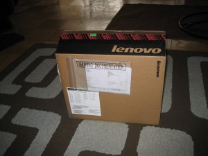
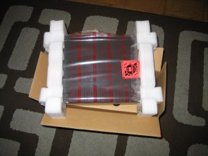
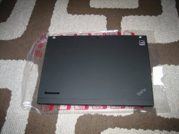
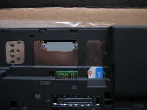
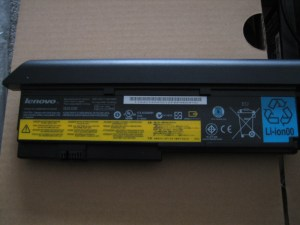
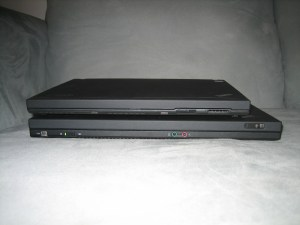
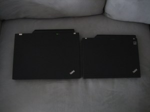
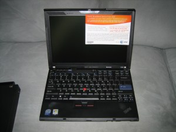

# Thinkpad X200 Unboxing

I just got my hands on the Thinkpad X200 that I ordered nearly 2 months ago.  I’m planning on writing a few posts on getting Ubuntu installed, but in the meantime I thought I’d be lame and do an unboxing since I’m so excited.

The box was pretty small, I was worried that they just shipped the accessories first.

Sure enough, though there was actually a laptop in there

That’s an ATT SIM card in the battery bay.  I don’t plan on using wireless broadband, so I hope I don’t have to de-activate this or anything.

The 9-cell battery is one of the things that sealed the deal on this laptop for me.  I’m sick of running out of battery after 2 hours or so.

The X200 is a bit smaller than my 14.1″ T61.  Hopefully not too small though.

Finally, the money shot.  A bit anti-climactic with all of the sticker spam.  I think that someone came up with a word for the stickers that they put all over laptops, but I can’t seem to find the blog post now.

That’s it for now.  I have already upgraded it with 4GB of 3rd-party RAM, which was not as uneventful as I would have thought.  After all, how much of a no-brainer is throwing more RAM into a machine (provided that you understand the difference between DDR2 and DDR3)?  I’ll have to save that story for another post.
