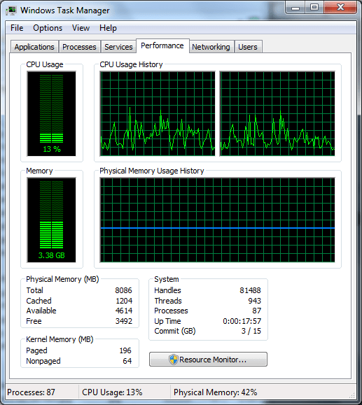

# Installing 4GB Kingston RAM in the Thinkpad X200

**Update: I have since successfully updated the firmware to v3.11 — see note below**

**Update2: I have since installed 8GB of ram in this machine using the v3.11 firmware — see below**

I ordered my Thinkpad x200 with the minium amount of RAM possible, fully intending to upgrade it to a full 4GB of third party RAM immediately on receipt.  It ended up taking two months to for Lenovo to fill the order, so I had that RAM sitting and waiting to go for a full month before I actually got the laptop.  So naturally the second thing I did (after just booting it to make sure it worked) was to pop in the RAM.

First boot after the new RAM was in and I couldn’t get past the Intel AMT firmware initialization in the POST sequence.  Usually when you have bad RAM or RAM that is not fully seated, you either get beeps from the system, or you can’t even get the BIOS screen.  I was able to see all 4GB reported in the BIOS setup screen, so I figured `what gives’.  I put the factory 1GB stick back in and it booted just fine.  I’m getting kind of worried at this point that I’m stuck with 4GB of RAM that I can’t use and can’t return, since it has been a month already since I bought it.

A little Googling turned up [this post](http://forums.lenovo.com/lnv/board/message?board.id=special_interest_utilities&message.id=3508) about some others having issues with Kingston ram on the x200.  The consensus on the Lenovo forums was that the latest BIOS (2.02 at the time of this issue) had problems supporting third party RAM.  So I went [here](http://www-307.ibm.com/pc/support/site.wss/document.do?sitestyle=lenovo&lndocid=migr-70347) and downloaded the 1.10 BIOS updater tool that runs under Windows.  I already had Windows installed from the factory, and the x200 doesn’t have a CDROM drive, so that was the most convenient thing.  The update went successfully, and my RAM worked afterwards.  I just don’t feel that great about not being able to use the latest firmware for a brand new laptop.  Hopefully they address this in later firmware revisions.

**Update:**

After posting this I have updated to firmware version 3.11 for an unrelated reason (updated monitor resolution support) but I can verify that the memory issue has been fixed. It appears to have been addressed in version 3.07. In the changelog there is an entry that reads:

Fixed an issue that set wrong memory type.

This is the only memory-related thing that I could find in the change logs, so I’m assuming that this is the fix that addresses it.

The changelog is [here](http://download.lenovo.com/ibmdl/pub/pc/pccbbs/mobiles/6duj35us.txt), and the download page is [here](http://www-307.ibm.com/pc/support/site.wss/document.do?lndocid=MIGR-70347#changes).

**Update2:**

I ordered [this ram on Newegg ](http://www.newegg.com/Product/Product.aspx?Item=N82E16820231294&cm_re=g_skill_sodimm-_-20-231-294-_-Product) and it worked fine. Lenovo quotes 4GB as the max ram for the x200 but this seems to be just the max available from them. The Santa Rosa chipset supports 8GB and it seems that the Lenovo firmware doesn’t prevent the laptop from using the full amount.

Here is a screenshot from my Windows 7 install:

