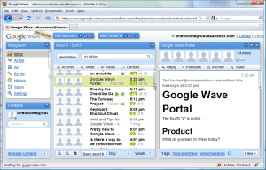

# Initial impression of Google Wave

Just last night I received an invite to the Google Wave Developer Sandbox.  Since Wave’s initial announcement at the Google IO developer conference, I had been reading up on the protocol and the API specifications, but this is the first opportunity that I’ve had to actually play with the front-end application.  My thoughts here will be limited to the user experience and the implications that the paradigms introduced by Wave will have on the way people might choose to collaborate and communicate on the web.  There is just so much to talk about, that I really have to limit this to first impressions of the UI and basic interaction model. I’m also going to ignore the fact that the Wave system is really not ready for prime-time yet.  The developer preview requires periodic reloads to regain its sanity, and there are frequent error dialogs that pop up.  Peformance is also not up to what Google showed in the Wave demos previously.

## **User Interface**

The basic layout of the UI is very much like a standard email client.  Standard navigation catagories appear in the left sidebar accompanied by a list of contacts. An inbox list and reader panes appear to the right of the main navigation.  Google’s use of GWT for the UI affords them a very dynamic UI, but I don’t think that this is a game-changer by itself.  Yahoo mail has been able to achieve similar things using YUI.  The reader pane shows a threaded view of the discussion around the wave.  Again, very similar to an email discussion thread, with the important difference that replies are shown as children of the original comments instead of quoting the original text.

## **User Interaction Model**

In my opinion, the real significance of the Wave client is not in the actual UI layout, but in the interaction model that it introduces.  There are several notable departures from what would be considered a typical email system or personal information management application.

First, items in the inbox are not static.  Items that have been recently modified get bumped to the top, much like in a discussion forum.  The difference is that it happens in realtime.  This sometimes means that as you are reaching to open a wave, it may shoot to the top, out from under you.  This allows you to see at a glance what is changing but as I quickly found out, once several very active waves are in the inbox, things will get quite busy.

The second major difference is that any part of a discussion thread may be modified at any time. This is significantly different than a typical email thread, or even a discussion thread on a forum. Collaboration can happen at the micro level of a single comment on a comment.  This level of granularity could be very powerful, but it also enables a complex set of interactions that could be equally confusing to newcomers to a wave, or to one’s future self, coming back to an archived wave.

## **Closing Thoughts**

I think that the really interesting thing about Wave is to see the kinds of communication patterns that could emerge as a result.  Wave offers integration points with the Web that email doesn’t have, and offers more power and flexibility than current Web-friendly communications mechanisms like Twitter. Other attempts have been made to merge messaging and the Web, but Wave seems like the best bet so far for connecting your inbox to the Web.
