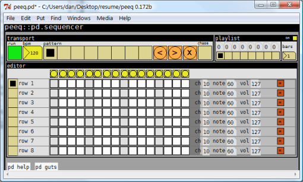

# Peeq: A MIDI sequencer in PD

I was digging through old music production stuff, and I found some patches that I did using [Pure Data](http://puredata.info/). Pure Data is a graphical programming language for music performance and sound data manipulation.  At the time that I wrote this, I really needed a live performance sequencer that had extensive keyboard shortcut coverage, and that could run on a low powered laptop that I had. While this patch met those requirements, the MIDI timing of PD on that old laptop turned out to be too inaccurate to be of much use as a sequencer. Maybe I had something wrong configuration-wise. I’m releasing this in the hopes that someone will find it useful.

Below is a copy of the online help file that can be accessed by clicking on the ‘pd help’ icon at the bottom of the sequencer UI.

> peeq is a simple pattern sequencer for the pd environment. it started out as a simple grid to bang out midi data, but has evolved to support multiple patterns and a small playlist. I wanted an extremely fast way to output midi data in a live situation, so flipping between patterns and entering row data can be done very quickly using the keyboard. the design is now modular, so rows may be added by simply creating instances of the row objects. The number of patterns may be increased by changing the limits of the arrays used to store them.

space bar – starts/stops sequencer

+/- – increment/decrement pattern

c – clears current pattern

</> – increment/decrement row selection

[/] – increment/decrement channel number of selected row

;/’ – increment/decrement note number of selected row

l – toggles playlist mode on or off

qwertyui and asdfghjk – these keys activate the steps of the currently selected row

chase – enabling this forces the pattern editor to follow the playlist.

1-4 – number keys assignable to pattern macros. actually any key may be assigned and any number of macros can be defined. look in the ‘keycommands’ subpatch under ‘guts’.

copyright:tekrosys.2003 (dan newcome)

[Download](http://www.box.net/shared/a6qq8tmnxx)

Note that PD must be installed on your system in order to run this patch.
