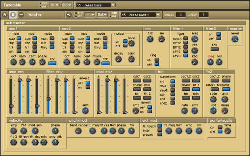
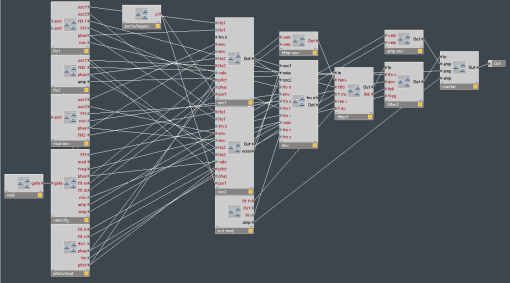

# Subtractor: A subtractive synth for Reaktor

Here is probably the first full synthesizer patch that I ever made.  I was impressed with the Subtractor synth that was included with Propellerheads’ Reason suite, and I wanted to have a standalone instrument version of it.  I had the idea of making my own version of it using some sampled single-cycle waveforms from the original synth.  I happened to be using Native Instruments’ Reaktor then, so unfortunately you will have to have it installed to run this patch.  It is a commercial piece of software.  This synth turned out pretty well, so maybe I’ll convert it to something else that is open-source.  Note that I sampled waveforms directly from Reason for the oscillators of this synth to try to preserve the character of the original.

I originally did this using Reaktor 3, and I converted it and re-saved it in version 5 to post here.

Here is a screenshot of the panel layout:

And here is a screenshot of the dsp structure:

The following is the ‘about’ info text from the patch:

> an emulation of the propellerheads’ subtractor synth from reason.  only the first 4 waveforms are included though, as i didn’t want to sample all 32.  to make up for it, you can mod the waveforms with any other waveform instead of being limited to modding the wave with itself.  also the lfos and envelopes may be assigned to more than one destination.  every other feature has been emulated with the exception of legato mode.  enjoy! [tekrosys]

[Download](http://www.box.net/shared/2ddfog4huc)
