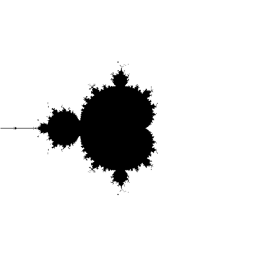

# Fun with fractals using HTML5

I was writing some fractal code and thought that it would be interesting to see if it could be done in Javascript with graphical output provided by the HTML5 <canvas> element.  As you can see, it worked just fine, albeit a little bit slow.



```

<html>
<head>
<script src="fractal.js" type="text/javascript" language="javascript"></script>
</head>
<body onload="drawFractal();">
<canvas style="border: 1px solid black" id="canvas" width="500" height="500"></canvas>
</body>
</html>

```
```

// file: fractal.js

// draw a point on our canvas element using the rect function
// set to draw a 1x1 square
function drawPoint( in_x, in_y ) {
 var canvas = document.getElementById( "canvas" );
 var ctx = canvas.getContext( "2d" );
 ctx.fillStyle = "rgb(0,0,0)";
 ctx.fillRect( in_x, in_y, 1, 1 );
}

// data structure that represents a complex number ( re + im )
function Complex( in_re, in_im ) {
 this.re = in_re;
 this.im = in_im;
}

// multiplication function for 2 complex numbers.. Performs FOIL
function ComplexMult( in_c1, in_c2 ) {
 var real = ( in_c1.re * in_c2.re ) - ( in_c1.im * in_c2.im );
 var imag = ( in_c1.re * in_c2.im ) + ( in_c1.im * in_c2.re );

 return new Complex( real, imag );
}

// addition of two complex numbers
function ComplexAdd( in_c1, in_c2 ) {
 return new Complex( in_c1.re + in_c2.re, in_c1.im + in_c2.im );
}

// absolute value of a complex number using sqrt( a^2 + b^2 ) form
function ComplexAbs( in_c ) {
 return Math.sqrt( in_c.re*in_c.re + in_c.im*in_c.im );
}

function drawFractal() {

 // resolution of our pixel image
 var x = 500;
 var y = 500;

 // real axis max/min
 var remin = -2;
 var remax = 2;

 // imaginary axis max/min
 var immin = -2;
 var immax = 2;

 // calculate the ranges from the bounds
 var rerange = remax - remin;
 var imrange = immax - immin;

 // number of iterations that we peform on each pixel
 var depth = 25;

 // iterate over each pixel in our output image
 for( var i=0; i < x; i++ ) {
 for( var j=0; j < y; j++ ) {

 var zn = new Complex( 0, 0 );

 // we need a mapping from pixels to complex plane
 var re = ( rerange/x ) * i - rerange/2;
 var im = ( imrange/y ) * j - imrange/2;
 var c = new Complex( re, im );

 // solve the iterative function for n = depth
 for( var n=1; n <= depth; n++ ) {
 // equation is zn = zn*zn + c
 zn = ComplexAdd( ComplexMult( zn, zn ), c );
 }

 // test to see if the point is in the set using 2 as the
 // boundary
 if( ComplexAbs( zn ) < 2 ) {
 drawPoint( i, j );
 }
 }
 }
}

```
