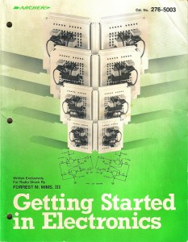

# Make: Electronics &#8211; The new Engineers&#8217; Notebook

Probably my first electronics book when I was a kid was [Forrest M. Mims](http://www.forrestmims.org/)‘ [Getting Started in Electronics](http://www.forrestmims.com/).  The book was wonderfully accessible to just about anyone, including 10 year old kids like myself. I read that book nearly every day, and I would always have a wish list of parts that I wanted to pick up the next time I could convince my parents to drive to the nearest Radio Shack.  Over the years it seems that the electronics hobbyist culture was on the wane until recently, when the rise of [hacker](http://hackaday.com/) [blogs](http://blog.makezine.com/) and O’Reilly’s [Make Magazine](http://makezine.com/) resurrected it seemingly overnight.

O’Reilly has published a book that is promising to be the [next generation’s version](http://www.boingboing.net/2009/12/11/make-electonics-a-gr.html) of the Forrest Mims classic — [Make: Electronics](http://oreilly.com/catalog/9780596153755). I’m glad to see that in addition to covering the hardware hacking scene, the Makers have seen to it that the venerable ‘getting started’ guide hasn’t been forgotten.
