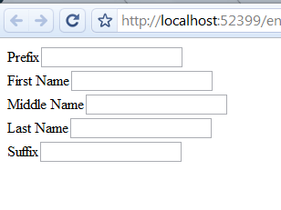

# Declarative dynamic ASP.NET forms

A few days ago, I [wrote a post](https://newcome.wordpress.com/2010/06/11/c-object-literal-notation/) dealing with literal data structures in .NET with a vague allusion to using them to do some declarative configuration duties. Well, to follow up, I’m going to show you a little bit about what I’m thinking. I’ve been really spoiled the last year or so doing Javascript, and I really want to get that code-as-data feeling going in some other work areas (.NET and MSCRM) so I took a look at some routine chores like pulling together a contact info form from declarative data. The code here is just a start, but should illustrate the basic idea.

For starters, we want to describe our ASP.NET form in a general way using the C# object literal notation that I described last time. Ideally we want to describe the underlying database/CRM field that corresponds with the form input, the label text, the field type, and so on. This makes things easy to change and also allows us to generate the configuration automatically from CRM for very flexible deployments. A field specification might look something like the following:

```

var field = new { 
	attribute = "db_firstname",
	formfield = "txtFirst",
	formlabel = "lblFirst",
	formlabeltext = "First Name",
	fieldtype = "text" 
},

```
Just looking at the naming conventions, just about any Winforms programmer should see where we are going with this: we are specifying the field labels and names here along with some information about the underlying data source. We won’t dig into the data source stuff until next time, but I’m going to put it in here as a reminder of where we intend to go with this stuff.

Now that we know what a single field specification looks like, let’s extend things a bit and create a data structure that describes the entity:

```

private dynamic spec = new { 
 entity = "contact", 
 fields = new object[] { 
 new { 
 attribute = "db_firstname",
 formfield = "txtFirst",
 formlabel = "lblFirst",
 formlabeltext = "First Name",
 fieldtype = "text" 
 },
 new { 
 attribute = "db_lastname",
 formfield = "txtLast",
 formlabel = "lblLast",
 formlabeltext = "Last Name",
 fieldtype = "text" 
 }
 }
};

```
One major thing to notice here is that we make use of the new ‘dynamic’ keyword. This makes life much easier, as otherwise we would have to use reflection to access the members of these anonymous types. If the 4.0 framework isn’t available, we can resort to using reflection, but I promise you it isn’t very pretty. Note also that we aren’t using the ‘var’ keyword here. We want to be able to pass the data structure around to methods that will generate the web form. Using var is very difficult since we would have to cast to object to pass it, and we’d end up using dynamic anyway, since otherwise we’d have to try to cast it to the anonymous type! Not for the faint of heart.

In the interest of brevity, we’ll only cover text input fields here, and only a single form layout. The crux of what we want to do is to create the Webforms controls and add them to the page using the specification shown above. We can do just that as follows:

```

private void AddFields( Control in_control, dynamic in_spec ) {
		foreach( dynamic item in spec.fields ) {
			HtmlGenericControl div = new HtmlGenericControl( "div" );
			div.Controls.Add( CreateLabel(
				item.formlabeltext,
				item.formlabel
			) );
			in_control.Controls.Add( CreateTextBox( item.formfield ) );
			in_control.Controls.Add( div );
		}
	}

```
The code could be much simpler if we were content with having our form fields laid out inline, but really — the bare minimum here is to have something of a standard field-per-line layout, so we have the overhead of creating elements using HtmlGenericControl controls.

Using the above code can be as simple as calling it from Page_Load as such:

```

 protected void Page_Load(object sender, EventArgs e) {
		AddFields( this.Controls[3], spec );
 }

```
In order to round things out, the following listing shows the convenience methods used in the main function that create the control and label objects themselves:

```

private Label CreateLabel( string in_label, string in_id ) {
		Label label = new Label();
		label.Text = in_label;
		return label;
	}
	private TextBox CreateTextBox( string in_id ) {
		TextBox textbox = new TextBox();
		textbox.ID = in_id;
		return textbox;
	}

```
I added a few more fields by simply adding items to the ‘spec’ data structure and ended up with something like the following:



Metaprogramming in C# is not nearly as easy as it is in Ruby or Javascript, but with recent additions to the framework, it is getting better. We’ll still have to rely on a bit of reflection from time to time, but hopefully this shows that it can be relatively straightforward.
