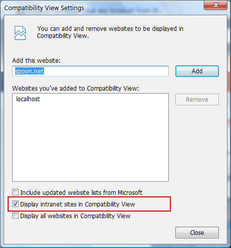
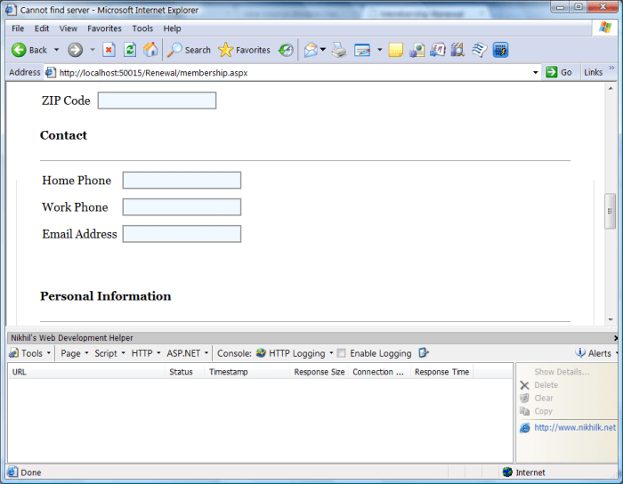

# IE6/compatibility view testing

On a recent client project, I was working on a few simple contact info forms for donations and dues renewals. I put together some nice, clean css layouts for the form fields and proceeded to the meat of the project, which was MS CRM integration.

Things were going well until it came time to do a client demo, and the page layout was broken. I had tested in all of the major browsers (IE/FF/Chrome/Safari/Opera) so I thought that all of the bases were covered.

After the demo we looked more closely at things and discovered that a default setting in IE causes things to display in compatibility view when the page is an ‘intranet’ site (which appears to include localhost). Here is a screenshot:

The layout bug is also apparent in IE6, so ‘compatibility view’ must be a similar rendering engine to the old IE6 (I don’t know this for certain, however).

Since the client is also running some instances of IE6, and I wasn’t sure that compatibility mode was the same thing as IE6, I wanted to test on IE6 itself. It has been a while since I looked around for testing solutions, and in the past I just had a virtual machine running Windows XP lying around to test on. However, the virtual machine was on a remote backup and would have taken me too long to set up again for quick testing. 

Fortunately, I found something that worked — running IE6 under [Spoon](http://spoon.net/). Spoon is some kind of application virtualization environment that lets you run an application as a plugin. I don’t know exactly how it works, but it appears to get around the limitations that other solutions have in getting the actual binaries for IE6 that are responsible for layout to load up. 

As icing on the cake, my old development plugins were installed just like they were before the new IE development tools were available. See the above screenshot showing the layout bug, along with Nikhil’s Web [Development Helper](http://projects.nikhilk.net/WebDevHelper) loaded at the bottom of the screen. I wonder if [IEDocMon](http://www.cheztabor.com/IEDocMon/index.htm) will work as well?
