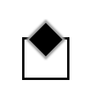
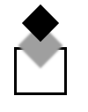

# Creating softened CSS callouts

Although I haven’t had much time to post on my blog, I’ve been doing a [few things with CSS](https://github.com/dnewcome/Donatello) lately. One question someone asked me recently was how to get a nice soft callout triangle done using just CSS.

I came up with three different basic solutions to this:

- Duplicate the element, changing the color and scaling the elements to create a layered gradient edge

- Rotate and clip using gradient

- Rotate and clip using box-shadow

My friend’s solution was like my first solution but nicer since he thought to adjust the opacity of the layers instead of messing with the color.

There is one other thing that I thought about later on, but didn’t get a chance to test, was to use [SVG filtering](https://developer.mozilla.org/En/Applying_SVG_effects_to_HTML_content) applied as a mask to the DOM element.

So, just to clarify what we are talking about, we want to end up with those [little triangles](http://www.dailycoding.com/Posts/purely_css_callouts.aspx) that mark the tab or page that we are on or form the little speech balloons that are everywhere on social networks these days. The traditional way of doing these was with images, but as we all know, lots of little images in our design is a drag.

The main technique for doing them in HTML DOM is to use the [transparent border trick](http://mrcoles.com/blog/callout-box-css-border-triangles-cross-browser/). We can give an element a border on one side and a zero width and height in order to get a triangle.

I’m going to show an alternative way of doing this using a rotated block element along with a rectangular clipping region. In order to show the steps I’ve made the clipping region visible until the end of the process so that you can see what is going on.

For the first cut at the problem, we’ll create a rotated block inside of a black-bordered div. We want to set a box shadow on the element, as that is what will give us the nice soft edge to our callout. Note that we are only showing the CSS for Webkit here. For full compatibility we’ll want to also include other browser-specific elements.

The following HTML will be used throughout the example so I’ll show it here only once:

```

<div class='clip'>
 <div class='triangle'></div>
</div>

```
The CSS goes thusly:

```

.triangle {
 position: absolute;
 width: 10px;
 height: 10px;
 left: 4px;
 top: -5px;
 background-color: black;
 -webkit-transform: rotate(45deg);
 -webkit-box-shadow: 0px 0px 1px 1px #a0a0a0;
}
.clip {
 height: 16px;
 width: 18px;
 border: 1px solid black;
 position: relative;
}

```
Giving us the following figure:



Once we have this in place, we want to arrange the actual element outside of what will be the visible area, that is, above the clipping region. At the same time we’ll want to move the offset of the box shadow further down into the visible part of the clipping region so that half of the box shadow is inside of the visible part of the region. The reason that we want to get the element totally out of the way is that some browsers display a thin line between the rotated object and its shadow, which is an ugly artifact that we want to get rid of. 

```

.triangle {
 position: absolute;
 width: 10px;
 height: 10px;
 left: 4px;
 top: -15px;
 background-color: black;
 -webkit-transform: rotate(45deg);
 -webkit-box-shadow: 6px 6px 1px 1px #a0a0a0;
}
.clip {
 height: 16px;
 width: 18px;
 border: 1px solid black;
 position: relative;
}

```
One tricky thing to note here is that the CSS top property is not affected by rotation, but the box-shadow offsets are relative to the rotated figure. This means that we have to adjust both the x and y values of the box-shadow offset while only changing the CSS top value of the div element.

The final position with all of the elements still visible looks like the following: 



Finally, let’s remove the training wheels. Remove the black border and set the overflow so the clipping region actually does its job of clipping.

```

 .clip {
 height: 16px;
 width: 18px;
 position: relative;
 overflow: hidden;
 }

```
The final figure looks like this:


Note the soft edges of the triangle. Presumably the top edge will be adjacent to some other element in the composition, so we don’t need to worry too much about softening that edge. 

There are some other fun things we can do using this technique including gradient triangles, but I’ll leave that to another post.
