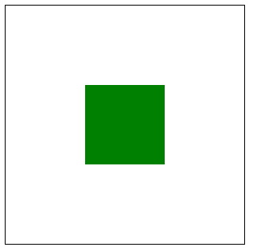
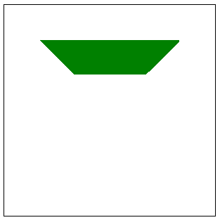

# Basics of CSS 3D transforms

CSS is getting more and more powerful these days, and now that CSS3 supports 3D transforms, we can do quite a lot without resorting to WebGL or some complex 3D drawing library. However, visualizing how 3D works in CSS can still be tricky, and it isn’t as flexible or rigorous as something like OpenGL. I’ve just started digging into 3D for possible extensions to the [Donatello](https://github.com/dnewcome/Donatello) drawing library, so I thought I’d jot down a few initial notes here.

We’ll be using the Firefox nightly for the examples. They should work in Webkit also by modifying the CSS property prefixes, but I won’t cover that here. I’m going to start out with a very basic code example to get started. There don’t seem to be many explanations on the Web concerning what the bare minimum is to get things working. 

The way the 3D transforms work is that there is a DOM element that sets the perspective reference, and elements that are to be rendered using 3D transforms are contained within this element. The reference element is not a viewport in the sense of typical 3D applications. Think of it more along the lines of the world scene graph. Elements may be outside of this container as is the case normally with CSS positioning using, say, a negative offset. There are other ways that content may appear outside of the parent element by way of the 3D transforms themselves as well.

Ok, let’s cut to the most basic example: a perspective view of a square div element that has been positioned perpendicular to the view reference plane.

To start with, let’s create a green square centered inside of a black-bordered “viewport” using standard CSS positioning and nothing fancy:

```

<div class="view">
 <div class="square">
 </div>
</div>

```
```

.view {
 border: 1px solid black;
 width: 300px;
 height: 300px;
}
.square {
 background-color: green;
 position: absolute;
 top: 100px;
 left: 100px;
 width: 100px;
 height: 100px;
} 

```
Firefox renders this like so:



Now in order to establish the 3D viewport and flip the square up onto its top edge, we need to do a few things. We’ll add the following CSS to the “view” class in order to put the observer over the center of the viewport element, 200 pixels overhead:

```

-moz-perspective: 200px;
-moz-transform-style: preserve-3d;
-moz-perspective-origin: 50% 50%;

```
Note that we need to use the vendor-specific “-moz” prefixes for the new CSS attributes. The W3C spec defines these without vendor prefixes, but for now, we need the prefixes if we want our code to work in any current real-world production Web browsers. Also keep in mind that the transform-style should be set to “preserve-3d”, since the default is “flat” and will effectively turn the 3D scene into a flat 2D projection, which will be very confusing to figure out if you don’t know what is going on. For example, our green square will end up just squashed into a shorter rectangle without this setting enabled.

In order to stand the green square up on end, we use the following CSS:

```

-moz-transform-origin: 0% 0%; 
-moz-transform: rotateX( 90deg ); 

```
Here we set the origin to the top left of the square and rotate it 90 degrees along the X axis (which is now aligned along the top edge of the green square courtesy of transform-origin).

The result looks like this:



Something to note if things don’t work as you’d expect is that the entire object must be beyond the viewer’s perspective. That is, if we stand a 100 pixel object up as we have done, and the perspective is set to 99 pixels, the object will disappear entirely from view. This caused me some pain early on in this exploration. Also, the position of the object in the scene doesn’t seem to affect its perspective rendering, but moving the perspective origin does. I’m not sure if this is intentional, but it is pretty confusing as you’d expect that moving either the camera or the object would have the same effect, but it doesn’t seem to. I could be mistaken on this, I’d love to hear from you if you have any more detail on how this works.

For more complex 3D examples check out the [Mozilla Developer Network](https://developer.mozilla.org/en/CSS/Using_CSS_transforms)

However beware that they aren’t very well explained so if you didn’t quite get what I showed above, I’d try to figure out the simple case first before looking at the Mozilla examples.
