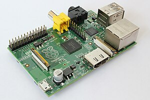

# Raspberry PI first look



The Raspberry PI single-board computer has been getting a lot of buzz since its launch early this year. For the first few months it was nearly impossible to get one of these things, and even now the only distributor that seems to have a reliable stock is Farnell in the UK. Well, I just got one for Christmas and now that I’ve gotten it up and running I’ll make a few comments on the process here and some initial thoughts.

My board is a Model B board, meaning it has the on-board Ethernet port. The setup here is the same for the other boards though, you just won’t be able to use the SSH server to log in remotely to it unless you attach a USB Ethernet interface.

## Requirements

There are a few things you need in order to get started. First is a power adapter that can power the board. The PI gets its power from a micro-USB jack on the board. I had a power supply from something else sitting around that worked ok, but it’s worth noting that you aren’t supposed to power this thing from your laptop or USB host directly. Powered hubs are ok, but the board draws 700ma or so, so be sure you don’t fry anything trying to get it juiced up.

Second thing is an SD card. Almost all of the available images need 2GB of space, so take this into consideration. I had a bunch of 1GB cards around but only one 16GB card that I’m using for my camera. I tried in vain to get a 1GB image to boot and ended up just clearing my camera card off and using the official Raspbian distribution. Of special note is that the PI will not boot from a USB stick, at least not without some kind of help (that is not available when you first pull it out of the box, for sure). This was a bummer since I was hoping to use a 2GB USB stick since I seem to have a lot of these lying around.

Third thing is a compatible display, at least while getting things set up. I used my TV with the composite video output. One of the 1GB images I booted from initially flickered so badly that I couldn’t make out any of the text from the Linux boot output. I was getting worried at this point, but it turns out that not all of the supported video modes on the PI flicker so badly, and the default frame buffer looked fine when I booted the official Raspbian distro image.

And finally, of course you need a USB keyboard. Once setup is done I just log in using SSH over the network, but initially we need a physical keyboard.

## Configuration

Once the board boots, a small setup utility runs that lets you set up things like keyboard and monitor overscan. Enabling a SSH server was very simple and worked fine the first time. By default, the PI tries to use a UK keyboard layout, so I had to mess with the keyboard to get a US key layout. This was more of a pain than than in some other Linux distros, but overall I figured it out quickly enough.

Video, or more accurately, overscan was the biggest pain. If you are using the HDMI output I don’t think this is an issue at all, but since I was using the composite video out, the edges of the display were being cut off by my TV. Confusingly, in order to enable overscan control, you have to disable overscan and set up some parameters for how much margin to add to the image. I didn’t get the configuration tool to work for this so I edited /boot/config.txt to correct my overscan settings.

```

# uncomment this if your display has a black border of unused pixels visible
# and your display can output without overscan
disable_overscan=0

# uncomment the following to adjust overscan. Use positive numbers if console
# goes off screen, and negative if there is too much border
overscan_left=24
overscan_right=24
overscan_top=0
overscan_bottom=0

```
The most confusing part about this is understanding what overscan is doing here. Usually overscan is a way to make sure that an NTSC or PAL image goes all the way to the edge of the screen, allowing some extra video content at the edges that is understood to be potentially cut off, sort of like the bleed area on a printing press image.

Overscan with respect to the PI means that we are adjusting the image to compensate for the output device. In my case I was actually using the overscan feature to create underscan so I could see everything on my TV.

The GUI doesn’t start by default, but can be started using startx manually. There is a configuration parameter to start the GUI on boot also. Note that startx won’t work using a remote X server. I’m using VcXsrv and putty to log into my PI from Windows, and to get the full desktop you’ll want to run startlxde, which starts the lxde desktop. 

Once we have gotten this far, things behave a lot like any Debian distribution. Using apt-get to install things works as expected, and is the underlying mechanism that the PI Store uses. The default Web browser is Midori, presumably since something like Mozilla would have been too big or resource intensive for the PI.

I’ve gone on to test some Audio and MIDI interfaces on the PI and install some other custom things, and so far everything pretty much works like any other Linux environment.
