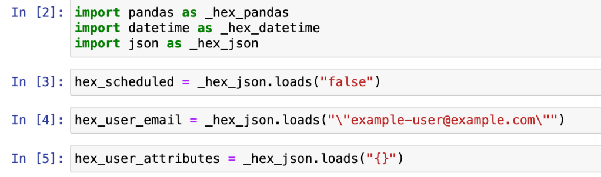

# Sagemaker

I’m looking into AWS Sagemaker now in order to run some machine learning models. I’m working with a team of Data Scientists who are developing models and I need to get my head around how this works from an Engineering standpoint.

I’m doing some basic investigation on all of the different types of hosting and environments. It’s clear to me that most Data Scientists are working in Python. We aren’t a Python shop generally, we are Go and Node. That doesn’t matter too much since we are using AWS ECS and running containers for everything so we can run a Python container.

Apart from this there are a bunch of different frameworks for doing ML. Pytorch seems to be the modern frontrunner. Back a few years ago I was messing with Tensorflow, but that seems long-in-the-tooth now.

Once we train a model then what? We need a way to set this stuff up in a production environment. AWS Sagemaker is designed for this, but the DS folks are working in Hex worksheets. Hex has some basic compatibility with Jupyter but with some extended attributes like SQL frames and input variables.

Yikes. So I’m going to try to get AWS Sagemaker Studio set up with an exported workbook and see what happens.

Sagemaker imports from Hex have some meta statements that aren’t directly in the Hex notebook. I’m working through this.

I have no idea where this is coming from, I can only imagine that Hex is adding this during export for compatibility.

I uploaded some `.csv` files and it picked them up in the code.

That’s a good start. I need to figure out how to get `lightgbm` installed here.
